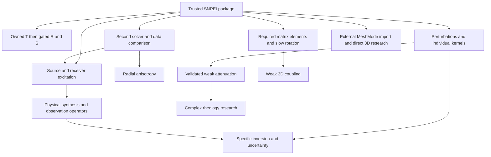

# Long-term development roadmap

This roadmap groups complete scientific/user tasks rather than adding interface switches. The original design v1.1 is the historical basis; phase 1 delivered version 0.1.0. [PHASE-2](PHASE-2.md) records the 0.2.0 scope; public delivery followed in 0.2.1. [PHASE-3](PHASE-3.md) defines the current explicit toroidal agreement increment. Plan, package and schema versions are managed independently. Future branches are not implicit commitments for the current release.

## A — trustworthy, interpretable SNREI workbench

Users obtain a complete path from a real model to eigenmodes, internal/surface fields, scientific comparison, reproducible lessons and production outputs. The baseline includes component nodes, one linked material point/trajectory, six question-led projects, presentation mode, a compact ExportSpec and a material-perturbation recipe. These form a complete interpretation layer with save/export responsibilities; multiple simultaneous points, dual viewports and general node classification are not baseline blockers.

Completion requires applicable ACCEPTANCE items, representative lessons, installation outside the repository, media readback and at least three sequential implementation reviews with repairs. A working page never grants unbenchmarked results a research-validation label. General inversion, full complex rheology, arbitrary 3D coupling, cloud services and plugin markets are excluded. Python/CLI and exports are first-class entry points.

### A2 — package usability and measured numerical ownership

Version 0.2.0 improves installed examples, English maintained artifacts, coherent website locales, reproducible surface-grid spacing and an independent elastic T pilot. The default validated solver remains intact. [NUMERICAL-OWNERSHIP](NUMERICAL-OWNERSHIP.md) records the executable T evidence and a gated T→R→S migration.

The scientific stack remains Python/NumPy/SciPy, already backed by compiled LAPACK. T promotion requires the named sphere, shell and PREM evidence, domain/normalization identity and resource checks. R next needs gravity, density sheets and fluid/solid boundary evidence. S additionally needs justified mixed/essential-space extraction, l=1 center/translation and all six topologies. A native/WASM rewrite requires a measured hotspot and stable interfaces; language preference alone is insufficient. Keep pinned upstream development references without permanently maintaining two complete production stacks.

### A3 — reusable same-model agreement evidence

Version 0.3.0 adds an installed elastic-T agreement report, native scientific figures, all-pair CSV and a copied two-resolution recipe. Complete source bundles, explicit mode pairs and continuous material-sided normalization make a report transferable without its original source paths. Three design rounds froze the scope; actual implementation and review acceptance are recorded in [PHASE-3](PHASE-3.md).

This step supports eventual numerical ownership without promoting the pilot: code agreement, each method's mesh change and an independent reference error remain separate. The next numerical increment should address a measured unsupported workload or the explicitly gated R formulation. A second import adapter remains a separate useful route; report serialization alone is not an importer, mode tracker or anisotropic solver.

## B — interoperability and material sensitivities

Two increments can proceed independently:

1. Import existing MINEOS results into the same workbench with original files and explicit normalization conversion; compare the same model across solvers. Extend to radial anisotropy or larger catalogs when required.
2. Advance explicit parameter perturbations and finite differences to bulk/shear/density/interface kernels. Explain depth/material sensitivity and frequency budgets, then mature the specific weak-Q quantities that have passed validation.

Dependencies are A's quality records, explicit mode pairs, region fields and independent references. An upstream kernel routine is not proof. Entry requires a concrete research question/catalog, reproducible input and independent comparison. Exit requires units/normalization/identity agreement, finite-difference checks, explicit handling of crossings/near-degeneracy, and an isotropic limit returning to A.

Add a second concrete adapter and analysis functions first, not a plugin platform. Introduce manifests and typed-array blocks only after real catalog-size evidence; retain the small JSON project path.

## C — seismic sources and observations

Users specify moment tensor, location/depth and source-time function to understand excitation, radiation and station spectra; displacement/velocity/acceleration gain physical units. Observed-data comparison requires complete metadata.

This needs canonical eigenfunctions, required spatial derivatives, mode identities and a concrete independent source/station synthesis reference. It does not wait for every B kernel or large-catalog feature. Source, receiver, instrument and processing choices become explicit objects; a renamed probe is not a seismogram.

Acceptance includes same-source/station independent synthesis, each family/component, coordinate conventions, reciprocity, source-time convolution and dimensional closure. Preserve response/window/filter settings for observations. Gravimeter, strain and rotation-rate operators advance individually. Do not silently download all waveforms, hide response removal, equate good fit with unique structure, or attach a generic Optimize button. Inversion is a separate research project.

## D — perturbations and mode coupling

Slow rotation, ellipticity and weak asphericity introduce singlet splitting, precession and S/T mixing. Results require an explicit basis and truncation, not just modified frequencies.

Dependencies are a high-quality SNREI basis and the actual matrix elements/selection rules needed by the perturbation; full B/C completion is unnecessary. Radial anisotropy can enter through B before general 3D tensors. Acceptance requires zero-rotation/zero-perturbation limits, angular selection rules, matrix energy properties, basis convergence and independent published/external cases. Frequency and mixed eigenvectors change together.

Use an explicit `CoupledMode` with a new field representation. Do not force mixed modes into one family/n/l label. Keep old projects readable; migration creates a new hash and retains source identities.

## E — research-question-driven advanced branches

These branches need not wait for all of D and are not an unlimited default backlog. Select work with data, benchmarks and maintenance responsibility.

| Branch | Scientific task | Evidence required before support |
| --- | --- | --- |
| Frequency-dependent complex rheology | Maxwell/SLS/Burgers attenuation, relaxation, complex modes | Passivity/causality, elastic/viscous limits, roots versus poles, complex normalization, independent small cases |
| Weak 3D structure/anisotropic coupling | Lateral material/topographic/tensor-induced mixing | Spherical limit, selection rules, bandwidth/basis convergence, external 3D reference |
| Direct 3D/nonperturbative rotation | More general planetary geometry and stronger rotation | Trustworthy mesh backend, reference gravity, fluid/solid constraints, slow-rotation/1D limits, separate mesh and spectral errors |
| Bounded inversion/uncertainty | Identifiability and observational constraints for specified parameters | Verified kernels/operators, covariance, synthetic recovery, prior/regularization sensitivity, withheld-data tests |

Use explicit `MeshMode` or complex-field contracts rather than hiding new physics in arbitrary metadata or radial-only arrays. A research branch can remain experimental while the reliable base package continues maintenance.

## Understanding, production and maintenance throughout

- Build lessons around verified conclusions before extending narratives. Research controls and presentation share one project.
- Make single-scene multi-format output reliable before introducing multi-scene sequencing, camera keyframes or batch layouts. Cross-model transitions are narrative changes, not continuous physical evolution.
- Measure waiting time, memory and frame loss before workers, batch solving, binary loading, caches or distributed execution.
- Keep scientific semantics and principal APIs stable. Implement a concrete migration when a new schema first appears. Persistent Python/TS field drift can justify evaluating a shared native/WASM kernel against real workloads.
- Scientific changes carry model, method, error and affected-export evidence. Small UI changes do not rerun all numerics. Dependency updates receive affected checks and release evidence rather than silently replacing default scientific results.

## Dependencies and stopping rules

Arrows represent concrete dependencies, not completion of entire lettered stages. Traceable observed spectra may appear as teaching data before source synthesis, but cannot serve as a claimed validated synthesis comparison. Weak-Q maturation needs the bulk/shear quantities it actually uses, not every density/interface kernel.

Prioritize clear user tasks that reuse trustworthy capabilities, have independent evidence and affordable maintenance. Use relative S/M/L/research-project estimates, not invented dates: baseline integration is L; linked nodes/trajectories/exports together are M; one parameter recipe is S; a second adapter, source/receiver workflow or kernel family is typically M–L; rotation coupling is an L research release; complex rheology/direct 3D are research projects.

Every new physical capability needs a domain-validation owner and independent benchmark. Missing evidence pauses that branch, not the reliable product. Keep plans/contracts/examples/evidence with code; source every default scene; fail clearly rather than pretending unsupported operations succeeded. Challenge the roadmap itself: small high-value work must not wait for a grand backend, and long-term ambitions must not make the first complete delivery endless.
